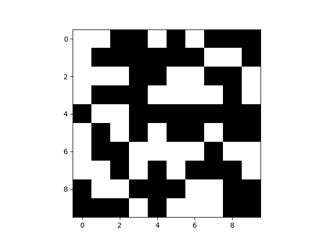

# Topics in Intelligent Systems Assignment

## Project Description
This project aims at reproducing the results of the paper [**Mean Field Multi-Agent Reinforcement Learning**](https://arxiv.org/pdf/1802.05438.pdf) by Yang et al. (2018). The paper proposes two novel algorithms, MF-Q and MF-AC for multi-agent reinforcement learning in large populations. The algorithms are based on the mean field theory and are designed to scale to large populations of agents. We also integrate the approach introduced in the paper [**VAST: Value Function Factorization with Variable Agent Sub-Teams**](https://openreview.net/pdf?id=hyJKKIhfxxT) by Phan et al. (2021) to train agents in a "Gaussian Squeeze" environment.

## Group K Members

1. Adriano Machado ([up202105352@up.pt](mailto:up202105352@up.pt))
3. Francisco da Ana ([up202108762@up.pt](mailto:up202108762@up.pt))
3. João Lopes ([up202402884@up.pt](mailto:up202402884@up.pt))
4. Tiago Teixeira ([up202403139@up.pt](mailto:up202403139@up.pt))


## Running Instructions
### Gaussian Squeeze

For this you'll need to start by creating a new conda environment and installing the required dependencies.

### Setting Up the Conda Environment

1. **Create a Conda Environment:**

    ```bash
    conda create --name tsi_mfrl_gaussian python=3.8.18 -c conda-forge
    ```

2. **Activate the Conda Environment:**

    ```bash
    conda activate tsi_mfrl_gaussian
    ```

### Installing Dependencies

With the Conda environment activated, install the required Python packages using `pip`:

```bash
pip install -r requirements_Gaussian.txt
```

### Running the Gaussian Squeeze Environment

To train models for the Gaussian Squeeze environment, use the train_gaussian.py script with the following arguments:

```bash	
python train_gaussian.py {algorithm} GaussianSqueeze-{Number_of_Agents} 
```

For example:

```bash
	python train_gaussian.py VAST-QTRAN GaussianSqueeze-200 0.25
	python train_gaussian.py VAST-QTRAN GaussianSqueeze-200 0.5
	python train_gaussian.py QMIX GaussianSqueeze-200
	python train_gaussian.py QTRAN GaussianSqueeze-200
	python train_gaussian.py IL GaussianSqueeze-200
```

After training the models, you can plot the results using the gaussian.py script:

```bash
python gaussian.py GaussianSqueeze-{Number_of_Agents} S
```


### Ising Model and Battle Game

Before compiling and running the project, it's recommended to create a dedicated Conda environment to manage dependencies.


1. **Create a Conda Environment:**

    ```bash
    conda create --name tsi_mfrl_btl python=3.6.1 -c conda-forge
    ```

2. **Activate the Conda Environment:**

    ```bash
    conda activate tsi_mfrl_btl
    ```


#### Installing Dependencies

With the Conda environment activated, install the required Python packages using `pip`:

```bash
pip install -r requirements_Ising_Battle.txt
```

### Running the Ising Model experiment


1. **Navigate to the Project Directory:**

    ```bash
    cd path_to_your_project_directory
    ```

2. **Run the Ising Model Simulation:**

    ```bash
    python main_MFQ_Ising.py
    ```

    This will execute the MFQ algorithm on the Ising model and generate the corresponding figures.

### Running the Battle experiment

Before running the Battle Game environment, you need to compile the MAgent package. Follow the steps below for compilation and execution.

#### Compiling MAgent on Linux

1. **Install Dependencies:**

    ```bash
    sudo apt-get update
    sudo apt-get install cmake libboost-system-dev libjsoncpp-dev libwebsocketpp-dev
    ```

2. **Build MAgent:**

    ```bash
    cd examples/battle_model
    ./build.sh
    ```

#### Compiling MAgent on OSX

**Note:** There is an issue with Homebrew for installing `websocketpp`. Please refer to [Issue #17](https://github.com/geek-ai/MAgent/issues/17) for more details.

1. **Install Dependencies Using Homebrew:**

    ```bash
    brew install cmake llvm boost@1.55
    brew install jsoncpp argp-standalone
    brew tap david-icracked/homebrew-websocketpp
    brew install --HEAD david-icracked/websocketpp/websocketpp
    brew link --force boost@1.55
    ```

2. **Build MAgent:**

    ```bash
    cd examples/battle_model
    ./build.sh
    ```

#### Training models for the Battle Game


#### 1. Add Python Path

To ensure that Python can locate the necessary modules, add the Battle Model's Python directory to your `PYTHONPATH`. You can do this by adding the following lines to your shell configuration file (`~/.bashrc` or `~/.zshrc`):

```bash
export PYTHONPATH=./examples/battle_model/python:${PYTHONPATH}
source ~/.bashrc  # or source ~/.zshrc
```

#### 2. Run the Training Script

To train models using a specific algorithm (e.g., **MFAC**), execute the training script with the appropriate arguments:

```bash
python3 train_battle.py --algo mfac
```

**Additional Options:**

To view all available command-line options and arguments, use the `--help` flag:

```bash
python3 train_battle.py --help
```

This will display detailed information about the various parameters you can set during training, such as `--save_every`, `--update_every`, `--n_round`, `--render`, `--map_size`, and `--max_steps`.

#### Running the Battle Game Using Trained Models

Once you have trained models for the Battle Game, you can use the `battle.py` script to simulate a match between two agents, with one agent using the **main model** and the other using the **opponent model**.

#### Running the Battle Script

To run the script and simulate battles between the agents:

```bash
python3 battle.py --algo ac --oppo mfq --n_round 50 --map_size 40 --max_steps 400 --idx 100 200
```

- `--algo`: Specifies the algorithm used by the **main agent** (e.g., `ac`, `mfac`, `mfq`, or `il`).
- `--oppo`: Specifies the algorithm used by the **opponent agent** (e.g., `ac`, `mfac`, `mfq`, or `il`).
- `--n_round`: The number of rounds (games) to simulate.
- `--map_size`: Size of the gridworld map (default is 40x40).
- `--max_steps`: Maximum number of steps per round.
- `--idx`: Model checkpoints to load for both agents (default is `[100, 200]`).

## Experiments description

### **Gaussian Squeeze**

**Environment.** In the Gaussian Squeeze (GS) task (Holmes-Parker et al., 2014), *N* homogeneous agents determine their individual action \(a^j\) to jointly optimize the most appropriate summation:  

**x = Σᵢ=₁ᴺ aⁱ**

Each agent has 10 action choices – integers 0 to 9. The system objective is defined as:  

**G(x) = x exp(-((x - μ)² / σ²))**

where **μ** and **σ** are the predefined mean and variance of the system. 

To perform this experiment we trained the agents using the following algorithms: **VAST-QTRAN**, **QMIX**, **QTRAN**, and **IL**. 

### **Ising Model**

**Environment.** In statistical mechanics, the Ising model is a mathematical framework to describe ferromagnetism (Ising, 1925). 

To fit into the MARL setting, the authors of the paper transformed the Ising model into a stage game where the reward for each spin/agent is defined by:

**rⱼ = hⱼaⱼ + ½ Σₖ∈𝒩(ⱼ) aⱼaₖ**

Here:
- **𝒩(ⱼ)** is the set of nearest neighbors of spin **j**,
- **hⱼ ∈ ℝ** is the external field affecting the spin **j**, and
- **λ ∈ ℝ** is an interaction coefficient determining how much the spins are motivated to stay aligned.  

Unlike the typical setting in physics, here each spin does not know the energy function, but aims to understand the environment and maximize its reward by learning the optimal policy of choosing the spin state: up or down.

In addition to the reward, the **order parameter (OP)** (Stanley, 1971) is a traditional measure of purity for the Ising model. **OP** is defined as:

**ξ = |Nₜ - N↓| / Nₜ**

where:
- **Nₜ** represents the number of up spins, and
- **N↓** represents the number of down spins.  

The closer the OP is to 1, the more orderly the system is.

<table>
  <tr>
    <th>Temp = 0.5 (T << Tc)</th>
    <th>Temp = 1.2 (T = Tc)</th>
    <th>Temp = 2.0 (T >> Tc)</th>
  </tr>
  <tr>
    <td></td>
    <td></td>
    <td>> Tc)"/></td>
  </tr>
</table>

### **Battle Game**

The Battle game in the Open-source MAGent system (Zheng et al., 2018) is a Mixed Cooperative-Competitive scenario with two armies fighting against each other in a grid world, each empowered by a different RL algorithm.  The goal of each army is to get more rewards by collaborating with teammates to destroy all the opponents. Agent can takes actions to either move to or attack nearby grids. Ideally, the agents army should learn to collaborate with teammates to defeat the opponents.

